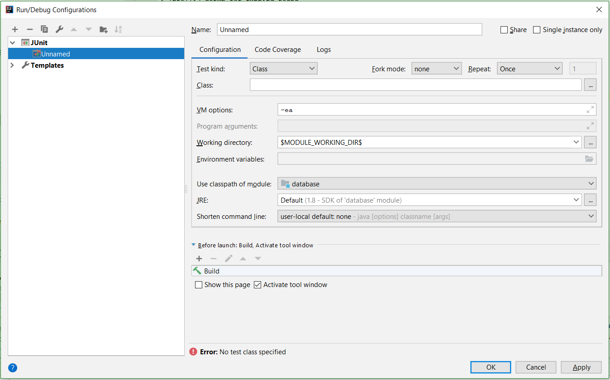

# IntelliJ setup for running tests

This document will help you set up IntelliJ for running an assignment's tests

1. Open up Run/Debug Configurations with Run > Edit Configurations.
2. Click the + button in the top left to create a new configuration, and choose JUnit from
   the dropdown. This should get you the following unnamed configuration:
   
3. Fill in the fields as listed below, then press OK.
   
   - Name: Proj2 tests (or whichever assignment you're setting up)
   - Test kind: Category
   - Category: edu.berkeley.cs186.database.categories.Proj2Tests (or the category corresponding to the assignment you're setting up)
   - Search for tests: In whole project
4. You should now see Project 2 tests in the dropdown in the top right. You can run/debug this configuration to run all the Project 2 tests.

# Newer versions of IntelliJ (2020.3+)

Starting with 2020.3 you may find a slightly different UI for creating a test configuration. The modified instructions are as follows:

1. Navigate to one of the test files for the project. For example, for Project 2 navigate to src/java/test/.../index/BPlusTree.java.
2. Check if there are any errors in the file. If you see anything highlighted in red its likely that JUnit wasn't automatically added to the classpath. If this is the case, find the first failed import and hover over the portion marked in red. This should bring up a tooltip with the option "Add JUnit to classpath". Select this option. Afterwards, no errors should appear in the file.
3. Follow the above instructions. To fill in the "Search for tests" option you'll need to hit "Modify options" in the top right, which should give a drop down menu with the option to set where "Search for tests" to "In whole project".
4. Hit OK. You should now see Project 2 tests in the dropdown in the top right.
